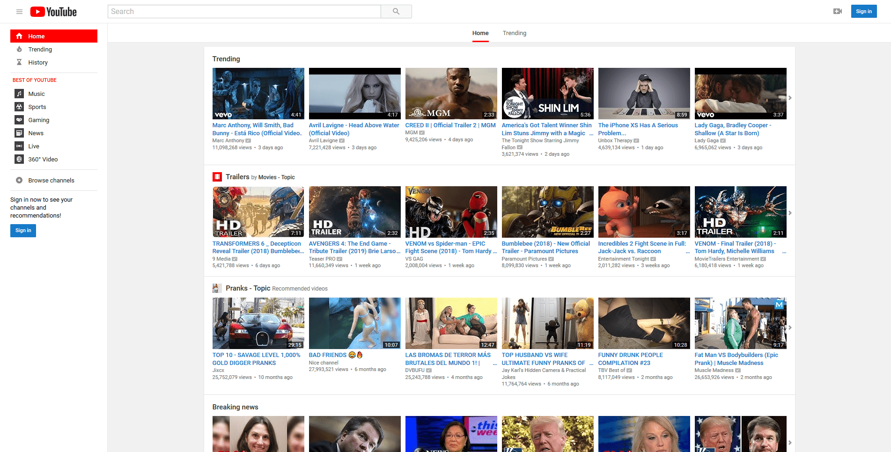

### Browser extension to restore classic YouTube look.
- [Firefox](https://addons.mozilla.org/en-US/firefox/addon/youtube-classic)
- ~~Chrome~~ Removed from the Google Chrome Web store ¯\\_(ツ)_/¯

Instead, you can download "crx" file from [releases page](https://github.com/thisdotvoid/youtube-classic-extension/releases), and follow instructions:
  1. Settings-Icon > More tools > Extensions
  2. Drag and drop the "crx" extension file onto the Extensions page from [step 1]
  3. Install

### Screenshots
##### Home:

##### Trending:

